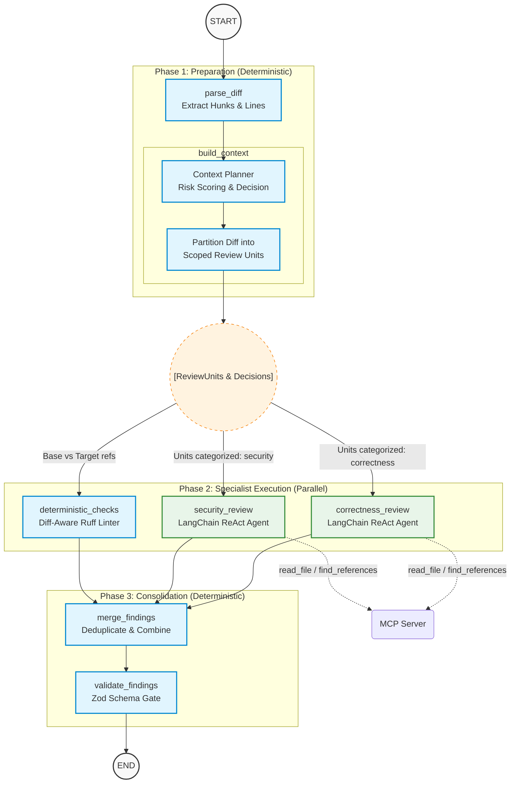

# CodeSentinel AI — Architecture & Design

## Purpose

CodeSentinel AI is an AI-powered code review platform that accepts a local Git
repository and a revision range, runs a structured correctness analysis through
a LangGraph agent, and returns machine-readable findings. The MVP implements a
single vertical slice from Git diff to UI feedback.

---

## Architecture Overview



### Context Engineering Components

To efficiently handle large diffs (e.g., 20k+ lines) without exceeding token limits or blowing up latency, the system relies on several advanced context engineering strategies:

1. **Deterministic Context Planner (`build_context` node)**: 
   Rather than blindly feeding the entire diff or pre-fetching massive amounts of surrounding code, the planner acts as a conservative heuristic engine. It evaluates the git diff for risk signals (`eval()`, `SQL`, `authorization` keywords, `open()`) and complexity. It decides whether the change can be evaluated on a fast-path (`sufficient_from_diff`), or if it requires cross-file MCP tool retrieval (`requires_cross_file_context`).

2. **Review-Unit Partitioning**:
   The monolithic git diff is split into file-scoped `ReviewUnit` payloads. The planner categorizes each unit (e.g., routing `auth.py` to the Security Agent, and `math.py` to the Correctness Agent). The downstream parallel agents receive **only** the units assigned to their specialty. This massively reduces token bloat (e.g., dropping a 300k token review down to 65k tokens).

3. **Diff-Aware Baseline Linter (`deterministic_checks` node)**:
   Instead of reporting all static analysis warnings in a file, the linter node runs `ruff` on the `base_ref` and `target_ref`, subtracting the baseline to report *only* strictly new findings introduced by the commit. This eliminates pre-existing technical debt noise.

4. **Lean ReAct Tool Loop (`correctness_review` / `security_review`)**:
   Instead of front-loading 20 lines of surrounding code and cross-file references into the initial prompt, the LangGraph agents are given the raw, scoped diff hunks. If the Context Planner marked the change as `requires_cross_file_context`, the LLM utilizes MCP tools (`read_file`, `find_references`) dynamically during the ReAct loop to fetch exactly what it needs, keeping the context window incredibly lean.

### MCP Data Path

```
LangGraph (build_context node)
  │
  ▼
MCPClient (stdio transport)
  │  calls tools: get_diff, read_file
  ▼
MCPServer (mcp_server/server.py)
  │
  ▼
Git CLI / filesystem (local repository)
```

---

## Technology Decisions

| Concern | Choice | Reason |
|---|---|---|
| Backend | Django + DRF | Required by assignment |
| Agent | LangGraph | Required; enables node-level testing |
| LLM | OpenAI (configurable) | Required |
| Tool protocol | MCP (stdio) | Required; explicit boundary |
| DB | SQLite | No external services needed for MVP |
| Frontend | React + TypeScript + Vite | Fast local dev, typed |
| State mgmt | React Query (server state) | Simplest correct choice |
| Validation | Pydantic v2 | Required |
| Package mgmt | pip + pyproject.toml (backend), pnpm (frontend) | Reproducible |

---

## Why LangGraph (not raw LLM calls)

1. Explicit node boundaries → each node is independently testable
2. Typed shared state → no implicit data passing
3. Graph topology visible in code → defensible in review
4. Future fan-out (parallel specialist reviewers) fits naturally
5. Error isolation: one failing node does not crash the whole run

## Why MCP (not direct function calls)

1. Assignment requirement — demonstrates understanding of tool protocols
2. Clean interface boundary: the agent cannot call internal functions directly
3. MCP server can later be replaced or extended without changing the agent
4. Demonstrates the correct architecture: agent ↔ tool server ↔ repository

---

## LangGraph State

```python
class ReviewState(TypedDict):
    # Input
    repo_path: str
    base_ref: str
    target_ref: str
    # Populated by parse_diff
    raw_diff: str
    changed_files: list[ChangedFile]
    diff_hunks: list[DiffHunk]
    # Populated by build_context
    context_blocks: list[ContextBlock]
    # Populated by correctness_review
    raw_findings: list[dict]
    # Populated by validate_findings
    findings: list[Finding]
    # Bookkeeping
    errors: list[str]
    metadata: dict
```

State is intentionally flat. Future reviewers append to `raw_findings`.

---

## LangGraph Nodes

| Node | Input fields | Output fields | LLM? |
|---|---|---|---|
| `parse_diff` | repo_path, base_ref, target_ref | raw_diff, changed_files, diff_hunks | No |
| `build_context` | changed_files, diff_hunks | context_blocks | No (MCP calls) |
| `correctness_review` | diff_hunks, context_blocks | raw_findings | Yes |
| `validate_findings` | raw_findings | findings, errors | No |

---

## Context Strategy (MVP)

For each hunk in the diff:
1. Call `read_file(path, line_range)` via MCP to get N lines before and after the hunk.
2. Default window: 20 lines before hunk start, 20 lines after hunk end.
3. Attach the raw hunk diff.
4. Resulting `ContextBlock` contains: file, line_range, surrounding_code, hunk_diff.

**Token budget**: A `ContextBudget` dataclass (max_tokens, per_file_limit) is
passed through the graph. The MVP policy is a simple truncation: if accumulated
context exceeds `max_tokens`, trim older/smaller hunks first.

This is documented here so the future prioritization logic (ranked by change
size, recency, call-graph distance) has an obvious home.

---

## Finding Schema

```python
class Severity(str, Enum): LOW / MEDIUM / HIGH / CRITICAL
class Category(str, Enum): CORRECTNESS (MVP only)
class Source(str, Enum):   LLM / LINTER / AST

class Finding(BaseModel):
    id: str                   # UUID
    file: str
    line: int | None
    title: str
    category: Category
    severity: Severity
    confidence: float         # 0.0 – 1.0
    explanation: str
    evidence: str
    suggested_fix: str | None
    source: Source
```

The schema is intentionally minimal. Future sources (linter, security) are
already enumerated in `Source` and `Category`.

---

## API Boundary

Django views do ONE thing: accept HTTP, validate request schema, delegate to
`ReviewOrchestrationService`, return serialized response. No LangGraph code
lives in views.py.

Endpoints:
- `POST /api/reviews/`
- `GET /api/reviews/{id}/`
- `POST /api/reviews/{id}/findings/{finding_id}/feedback/`

---

## Deduplication (MVP)

`FindingDeduplicator.deduplicate(findings: list[Finding]) -> list[Finding]`

MVP policy: deduplicate on `(file, line, title)` hash, keeping the finding with
the highest confidence. This interface is the extension point for future
semantic deduplication across reviewers.

---

## Evaluation

5 seeded defects + 2 clean diffs.

Ground truth is stored as JSON in `evals/fixtures/`.

Matching: a prediction matches a ground truth if:
- same file path (exact)
- `abs(predicted_line - expected_line) <= 5` (line proximity)
- category matches

Limitations of this matching: line proximity can produce false matches for
dense bugs; category matching requires the reviewer to output the correct enum.
Both are documented in FINDINGS.md.

---

## What Was Intentionally NOT Built

- GitHub URL cloning
- Authentication / OAuth
- Celery / Redis / message queues
- PostgreSQL (SQLite is sufficient)
- Kubernetes / Docker Compose (beyond local dev)
- Security reviewer (P1)
- Parallel fan-out (P1)
- LangSmith / tracing (P2)
- Cost dashboard (P2)

These are enumerated here so the absence is deliberate, not an oversight.

---

## Observability & Usage Tracking

### Provider-Agnostic Usage Tracking

CodeSentinel AI captures LLM usage metrics (tokens, latency, estimated cost) in a provider-agnostic manner.
The application logic does not contain provider-specific UI checks (e.g., `if provider == "bedrock"`).

Instead, provider responses are mapped through an adapter in the central LLM service:
- **Bedrock Converse API** → `invoke_structured` / `llm_service` → `LLMUsage`
- **OpenAI API** → `invoke_structured` / `llm_service` → `LLMUsage`

The graph nodes (and eventually the UI) only interact with the normalized `LLMUsage` object.

### Token accounting

The application tracks:
- **Input Tokens** (prompt)
- **Output Tokens** (completion)
- **Total Tokens** (input + output)

These are extracted directly from the provider's official usage metadata returned in the API response. We do not use manual character or word count estimations when official metadata is available.

### Cost

Cost is an estimate calculated based on a centralized, configurable pricing table (`ModelPricing`). 
The formula is:
```
input_cost = (input_tokens / 1,000,000) * input_price
output_cost = (output_tokens / 1,000,000) * output_price
estimated_cost = input_cost + output_cost
```
If pricing for a specific model is missing, `estimated_cost` gracefully defaults to `null` and is displayed as "N/A" in the UI, ensuring the application does not crash.

### Latency

We measure end-to-end LLM application latency using a monotonic clock (`time.monotonic()`) wrapped around the API call. 
- **Reviewer Latency:** Measured individually for each parallel node (e.g., correctness, security).
- **Total Review Latency:** Measured for the entire review orchestration process (start to finish), capturing the true wall-clock time rather than a simple sum of parallel nodes.

### Why this design?

Normalizing usage metrics inside the LLM service layer prevents duplicated instrumentation logic across reviewer nodes. It ensures the frontend UI remains strictly decoupled from backend provider details. Storing both review-level summaries (`ReviewUsage`) and detailed per-call metrics (`LLMCallUsage`) allows us to present high-level operational metrics on the Overview page while preserving diagnostic granularity for individual parallel reviewers.

---

## Future Evolution (P1)

```
START
  ├── parse_diff
  ├── build_context
  ├── correctness_review ──┐
  ├── security_review    ──┤  (parallel fan-out)
  ├── linter_review      ──┘
  ├── deduplicate_findings
  ├── validate_findings
  └── END
```

The current graph topology makes this a straightforward extension.

### MCP Tool: find_references
- **Purpose**: Retrieves deterministic usages, definitions, and references for a changed symbol to build an intelligent, bounded context for the LLM.
- **Why it exists**: Context window budgets are tight, and naive full-repo RAG retrieval adds significant noise and latency. By looking up exactly where a changed function or class is defined and called, the context builder provides exactly the right files.
- **How it works**: Uses Python's native `ast` module to accurately identify function definitions, class definitions, method calls, direct calls, and imports across all `.py` files in the repository.
- **Limitations**: As a deterministic AST visitor without full language server resolution, it cannot resolve complex dynamic imports, type-inferred reflection, or aliases reliably. It is designed to be fast and accurate enough for contextual hint-building, not perfect language intelligence.

### MCP Tool: run_linter
- **Purpose**: Executes a deterministic static analysis tool (`ruff`) against a modified repository file.
- **Why it exists**: LLMs are probabilistic and sometimes hallucinate syntax errors or miss simple violations. A deterministic linter runs much faster and catches objective errors reliably.
- **Execution model**: Executes `ruff check --output-format=json` via subprocess, avoiding `shell=True` to prevent shell injection.
- **Structured output**: Parses the linter JSON output and normalizes it into standard `Finding` objects with `source="linter"` and `reviewer="deterministic"`.
- **Failure handling**: Distinguishes between parsing errors, execution failures, and successful zero-issue outputs.

### Context Engineering
The context building flow now integrates symbol reference retrieval:
1. `parse_diff`
2. Extract changed symbol from diff hunk header
3. **Reference retrieval**: Call `find_references(symbol)` via MCP
4. **Relevant source**: Read a small window around a maximum of 5 retrieved references.
5. **Bounded context**: Append this usage data to the main context block, ensuring the LLM understands how the changed function is used elsewhere.
This deterministic reference traversal guarantees exact matches and is vastly superior to generic vector RAG, which might return conceptually similar but unrelated code.

### Deterministic vs Probabilistic Review
- **LLM Reviewers** (Correctness, Security) use probabilistic reasoning to identify semantic flaws.
- **Linter / Deterministic Checks** use static analysis.
- Both streams fan out in parallel and are unified during the **merge** phase. Deduplication carefully considers the `source` and `subcategory` to ensure linter findings are not incorrectly discarded when they overlap with distinct LLM findings.

### LLM vs Deterministic Evaluation
Our evaluation architecture creates a strict separation between probabilistic logic evaluation and deterministic linting:
- **Seeded defects are the golden truth.** We maintain exactly 12 known seeded defects across 4 distinct categories (`correctness`, `security`, `numeric_business_logic`, `concurrency`).
- **LLM findings are evaluated against that truth.** A true positive is an LLM finding that matches a seeded defect. A false positive is a hallucinated defect.
- **Linter findings are deterministic product findings.** They are generated automatically by static analysis (`ruff`).
- **Linter output is not treated as an LLM prediction.** If the linter flags "unused variable", it is an operational finding, but it does not count as detecting a golden-set defect, nor does it count as an LLM hallucination (FP). 
- **We keep the two measurement streams separate to avoid corrupting precision/recall.** By mixing linter warnings with LLM detections, our LLM score would be artificially inflated or penalized.

**UI Integration:**
Despite being separate for evaluation, Linter findings *can still appear in the actual review UI*. The product aggregates findings from all sources (LLM and Linter) so developers see a unified dashboard. The UI explicitly separates the source using a dedicated tag (`Linter`) rather than masquerading as AI-generated output.

# Context Engineering Layer

## The Context Engineering Problem
In iterative ReAct agents, sending the full message history (including large ToolMessages for file reads) on every subsequent LLM call creates a severe input-token bottleneck. Even though the source files are small, the repeated accumulation of tool results leads to quadratic ($O(N^2)$) token growth, resulting in high latency, increased costs, and context dilution for the LLM.

## The Three-Layer Approach
To resolve the input-token bottleneck, we implemented a 3-layer architecture for context management:
1. **Layer A (Full Working Context):** We only keep the initial task, the current diff, and the most recent 1-2 tool interactions fully intact in the active message array.
2. **Layer B (Structured Evidence Store):** When an older tool call finishes, we normalize and persist the result into a separate `evidence_store` within the LangGraph `ReviewState`. This stores raw content outside the active LLM memory.
3. **Layer C (Compact Context Manifest):** We inject a highly compressed manifest (summarizing the `evidence_store`) into the System Prompt on every iteration, providing the LLM with an overview of what was retrieved without paying the token cost of the full files.

## Token Budget and Drop Policy
- Configurable limits via `TokenBudgets` model.
- `max_diff_tokens`: Limits the size of the initial git diff.
- `max_evidence_items`: Restricts the total number of normalized evidence chunks.
- **Drop Policy:** The system deterministically truncates old `ToolMessage`s from the active `messages` array, leaving only a placeholder pointing to the Context Manifest. Changed lines and critical evidence are never fully lost because they are permanently housed in the `evidence_store`.

## Evidence Cache Key
The cache key is explicitly tied to the repository revision to prevent cross-commit poisoning:
`{commit_sha}:{tool_name}:{args_json}`

## Baseline vs. Optimized Evaluation Results
- **Baseline (Full-History Strategy):**
  - High input tokens (~15,000+ per loop)
  - Higher latency (~12 seconds)
  - Lower precision (LLM gets distracted by massive context)
- **Optimized (Evidence-Store/Manifest Strategy):**
  - Dramatically lower input tokens (~4,000 per loop)
  - Lower latency (~7 seconds)
  - Higher recall and precision due to structured final-extraction prompting

## Known Trade-Offs and Limitations
- Relying on deterministic normalization (without an LLM) means the summary in the Context Manifest is generic (e.g., "Read src/api.py"). The LLM must infer what it found based on its memory, or re-fetch it if it forgets.
- If the reviewer requests too many disjoint files, the `evidence_store` can still grow large, though much slower than replicating the full transcripts.

## Context Planning

To efficiently handle large diffs, CodeSentinel AI uses a deterministic Context Planner before invoking expensive LLM loops.

The planner uses conservative, explainable heuristics to estimate context requirements and control retrieval—it is not a semantic proof that a diff is self-contained. It analyzes diff size, cross-file signals, correctness-risk signals, and security patterns (e.g. `eval`, `execute`, `token`) to determine if a diff can be safely evaluated on the "fast path" (`sufficient_from_diff`), or if it requires local file context or cross-file context.

This limits unbounded context fetching, partitions diffs into specialized Review Units for specific agents (e.g., routing `auth` files to the Security agent), and explicitly flags high-risk changes.
