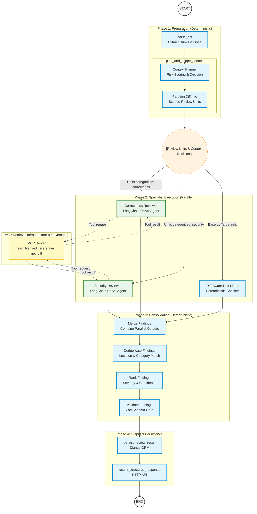

# CodeSentinel AI — Architecture & Design

## Purpose

CodeSentinel AI is an AI-powered code review platform that accepts a local Git
repository and a revision range, runs a structured correctness analysis through
a LangGraph agent, and returns machine-readable findings. The MVP implements a
single vertical slice from Git diff to UI feedback.

---

## Architecture Overview

*Note: Persistence and API response handling occur in the Django service after the LangGraph orchestration completion.*

### Context Engineering Components

To efficiently handle large diffs (e.g., 20k+ lines) without exceeding token limits or blowing up latency, the system relies on several advanced context engineering strategies:

1. **Deterministic Context Planner (`plan_and_scope_context`)**: 
   Rather than blindly feeding the entire diff or pre-fetching massive amounts of surrounding code upfront, the planner acts as a conservative heuristic engine. It evaluates the git diff for risk signals (`eval()`, `SQL`, `authorization` keywords, `open()`) and complexity. It decides whether the change can be evaluated on a fast-path (`sufficient_from_diff`), or if it requires cross-file MCP tool retrieval (`requires_cross_file_context`).

2. **Review-Unit Partitioning**:
   The monolithic git diff is split into file-scoped `ReviewUnit` payloads. The planner categorizes each unit (e.g., routing `auth.py` to the Security Agent, and `math.py` to the Correctness Agent). The downstream parallel agents receive **only** the scoped units assigned to their specialty. This massively reduces token bloat (e.g., dropping a 300k token review down to 65k tokens).

3. **Explicit Context-Retrieval via ReAct Tool Loop**:
   The graph does not imply that all context is always retrieved before the reviewers run. Instead, the context planner determines the expected context requirements, and the reviewers retrieve additional evidence through MCP only when necessary.
   - The LLM identifies missing context that may change the review conclusion.
   - Issues a `Tool request` (e.g., `read_file` or `find_references`).
   - Receives the `Tool result` from the MCP Server.
   - Continues reasoning to reach a final structured finding.
   
4. **Diff-Aware Baseline Linter**:
   Instead of reporting all static analysis warnings in a file, the deterministic linter node compares the `base_ref` against the `target_ref`, stripping out pre-existing technical debt to report *only* strictly new findings introduced by the commit.

5. **Merge, Deduplicate, and Rank Pipeline**:
   After the parallel execution, findings are consolidated. They undergo strict deduplication (to merge identical findings reported on adjacent lines) and are then ranked by Severity (CRITICAL > HIGH > MEDIUM > LOW) and Confidence, ensuring the most actionable signals are prioritized before returning the HTTP response.
6. **Instantaneous Cross-Agent MCP Tool Caching**:
   Because the `correctness_review` and `security_review` agents execute in parallel, there is a high probability they will request the same surrounding file context or cross-file references. To prevent redundant sub-process executions and latency spikes, the system uses a shared `tool_cache` in the LangGraph state. 
   - A deterministic hash is generated based on the target revision, tool name, and arguments.
   - If the Correctness agent reads `src/auth.py`, it immediately writes the result to the shared memory cache.
   - If the Security agent requests the same file moments later, it triggers an `MCP_TOOL_CACHE_HIT`, bypassing the MCP server entirely and instantly feeding the data back to the LLM.