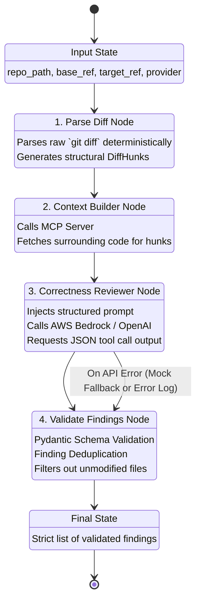

# CodeSentinel AI — System Architecture

This document describes the end-to-end architecture for the CodeSentinel AI Minimum Viable Product (MVP). The system is designed to provide high-precision AI code reviews by parsing local Git diffs, fetching surrounding context, analyzing code via LLMs, and strictly validating the output.

---

## 1. High-Level System Architecture

The architecture follows a standard 3-tier model but introduces a background AI orchestration engine (LangGraph) and a Model Context Protocol (MCP) server for local file access.

```mermaid
flowchart TD
    subgraph Frontend [React Frontend (Vite)]
        UI[Review Dashboard]
        API_Client[Axios Client]
    end

    subgraph Backend [Django Backend]
        DRF[Django REST Framework]
        DB[(SQLite DB)]
        
        subgraph Orchestration [AI Orchestration]
            LG[LangGraph Engine]
            Git[Git Service]
        end
    end

    subgraph Context_Layer [Context Layer]
        MCP_Server[MCP Server (Subprocess)]
        FS[Local File System]
    end

    subgraph External_APIs [LLM Providers]
        AWS[AWS Bedrock]
        OAI[OpenAI]
    end

    %% Flow
    UI -->|Create Review Request| API_Client
    API_Client -->|POST /api/reviews/| DRF
    DRF -->|Save State| DB
    DRF -->|Trigger| LG
    LG -->|Extract Diffs| Git
    LG -->|Fetch Code Context| MCP_Server
    MCP_Server -->|Read Files| FS
    LG -->|Prompt + Context| AWS
    LG -->|Prompt + Context| OAI
```

### Core Components
1. **Frontend (React + TypeScript)**: A lightweight Vite-based SPA that allows users to configure reviews (repo path, git refs, model selection) and visually inspect the identified bugs with inline code evidence.
2. **Backend (Django + DRF)**: Handles HTTP requests, persists review history and feedback to the database, and kicks off the AI workflow.
3. **Model Context Protocol (MCP)**: Runs as an isolated subprocess. It acts as a secure bridge for the AI engine to read entire files from the local filesystem to build context.
4. **LLM Routing**: Dynamically routes prompts to either AWS Bedrock (e.g., DeepSeek, Claude) or OpenAI (e.g., GPT-4o) based on user configuration.

---

## 2. LangGraph Workflow (The AI Brain)

The core logic of CodeSentinel is managed by **LangGraph**, which passes a heavily typed `ReviewState` dictionary between isolated nodes. 

This state-machine approach ensures that the LLM is tightly controlled, preventing hallucinations and ensuring deterministic parsing of Git diffs before the AI ever sees the code.



### Node Details:
*   **`parse_diff_node`**: Executes `git diff HEAD~1..HEAD` via standard subprocess. Uses the `unidiff` Python library to parse the raw text into structured objects. **No LLM is used here** to prevent hallucinated line numbers.
*   **`context_builder_node`**: Loops through the parsed diff hunks. Communicates with the MCP server via `stdio` to extract 20 lines of code above and below the change to give the AI the full picture.
*   **`correctness_reviewer_node`**: Constructs a massive prompt containing the code blocks. Uses `langchain`'s `.with_structured_output(ReviewFindings)` to force the AI to return data that matches our exact Pydantic schema.
*   **`validate_findings_node`**: Acts as a strict firewall. It verifies that the LLM didn't hallucinate bugs in files that weren't even changed, deduplicates identical findings, and catches any JSON validation exceptions safely.

---

## 3. Data Schema & Strict Validation

To ensure the frontend receives predictable data, the system relies heavily on **Pydantic v2** models.

```python
class Finding(BaseModel):
    file: str
    line: int
    title: str
    category: Category = Category.CORRECTNESS
    severity: Severity
    confidence: float = Field(ge=0.0, le=1.0)
    explanation: str
    evidence: str
    suggested_fix: str
```
If the LLM omits any of these fields (or hallucinates an invalid severity), Langchain will attempt to parse it, and if it fails, the orchestrator logs the error and safely returns 0 findings without crashing the web app.
